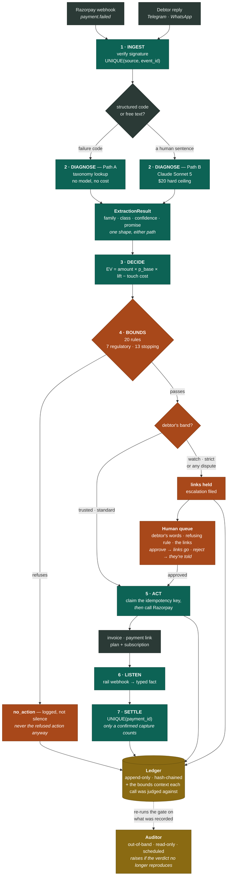
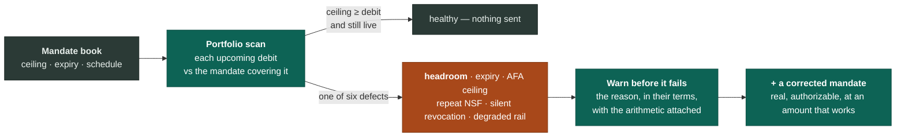

# TrueCommit

**A bounded autonomous agent for Indian B2B and subscription revenue recovery.**
Razorpay AI Buildathon 2026, Track 03.

It reads what a debtor actually said, works out which kind of failure it is,
and takes the action that fits — while a separate deterministic gate decides
whether it's allowed to. The part worth judging isn't that it acts. It's what
it refuses to do, and that the refusals are checkable by someone who doesn't
trust me.

> **Try it:** **https://truecommit-tawny.vercel.app/** — put your own number
> in and it will really message and call you.

---

## It moved real money on Razorpay's rails

**10 agent-chosen decisions ran with `dry_run=False`. 5 created real
invoices. All 5 were paid. ₹215,867 captured.**

The agent chose each action itself, `check_bounds()` gated it, and ACT called
Razorpay. No human between the decision and the object.

**Every status was fetched back from Razorpay at report time**, not read out
of my own ledger — my ledger records what the agent *believed*; the fetch
records what Razorpay holds. → [`REAL_BATCH.md`](docs/evidence/REAL_BATCH.md)

**What it does not show:** pipeline completeness, not a recovery rate. I paid
those invoices myself. Nothing here establishes that real debtors pay — the
comparison in [`RESULTS.md`](docs/RESULTS.md) is **simulated**.

## What's deployed, and where

| | Where | What runs there |
|---|---|---|
| **Dashboard** | **[truecommit-tawny.vercel.app](https://truecommit-tawny.vercel.app/)** | The console — a static page. Fire any channel at your own number, watch the case file, approve escalations |
| **Proxy** | Vercel Functions (`api/*.js`) | Holds `DEMO_TRIGGER_SECRET` server-side so the browser never does |
| **Backend** | [track-03.onrender.com](https://track-03.onrender.com) | FastAPI, always-on: the seven agents, the ledger, the Auditor on a schedule, and every inbound webhook |
| **Money** | Razorpay (test mode) | Invoices, payment links, plans + subscriptions, and `payment.failed` / `payment.captured` webhooks |
| **Messaging** | Twilio · Telegram | WhatsApp (approved Content Template), TTS voice calls, two Telegram bots — collections and subscriptions |

No laptop in the loop and no tunnel. Every inbound webhook is
signature-verified before anything reads it — Razorpay's own scheme,
Telegram's `secret_token`, and Twilio's HMAC-SHA1 over URL + sorted params.

## How it works, in six lines

1. **The model may see and speak. It may never spend.** It produces a typed
   *candidate*; the amount, the date, the state transition and the gate
   verdict are all deterministic code.
2. **Seven agents** — INGEST → DIAGNOSE → DECIDE → **BOUNDS** → ACT, plus
   LISTEN → SETTLE. None can call another; they coordinate only through an
   append-only, hash-chained ledger.
3. **One gate.** 20 rules — 7 regulatory (RBI, TRAI, MSMED) and 13 stopping
   rules, filed apart because calling company policy "regulation" would
   overstate it. Each rule is written twice, and a 5,000-case property test
   asserts the two implementations agree.
4. **A refusal is a decision**, logged — never silence, and never the refused
   action anyway.
5. **The debtor's record decides who needs a person.** Low-credibility
   debtors and *any* dispute get their payment links **held** for human
   approval.
6. **The subscription half is predictive** and uses no model: it reads the
   mandate book and finds debits that cannot succeed, before they fail.

## The pipeline



**The two things to read off it.** Every path reaches the ledger — including
refusals and held links, not just the actions that happened. And the dotted
arrow runs *backwards*: the Auditor re-derives each verdict from the context
the ledger stored, so "the gate ran" is checkable rather than asserted.

### And the predictive half, which uses no model at all



`max_amount_paise < upcoming_debit_paise` is a comparison, not a prediction.
It is right by construction, which is the point — a defect provable from the
object's own shape needs no behavioural assumption at all.

## What the ₹215,867 is, precisely

Because the two numbers in that sentence measure different things:

| | |
|---|---|
| **10** | decisions the agent made — diagnosis, EV, gate, chosen action |
| **5** | of those became real Razorpay invoices |
| **5** | hit Razorpay's invoice-creation **rate limit** and errored — not gate refusals, and not agent mistakes ([`WHAT_BROKE.md`](docs/WHAT_BROKE.md) #28) |
| **0** | were refused by `check_bounds()` — correct for Family B reissues at these amounts |
| **5 of 5** | created invoices were paid, status **fetched back from Razorpay** |
| **₹215,867** | the sum of `amount_paid` from that fetch |

The rate limit is why 10 decisions produced 5 objects. It's documented rather
than smoothed over, and the retry/spacing fix it prompted has 11 tests.

→ Full walkthrough in
[**`PROJECT_EXPLAINED.md`**](docs/PROJECT_EXPLAINED.md)

## Run it

```bash
uv sync
uv run pytest          # 1,477 collected: 1,466 run without credentials, 11 skipped
uv run trucommit serve # the webhook receiver + scheduled Auditor
```

The 11 skipped are the Razorpay-live-only suite; they skip cleanly rather
than failing. [`SETUP.md`](docs/SETUP.md) has the clean-clone timing.

## The documents worth reading

**Start here**

| | |
|---|---|
| [**`PROJECT_EXPLAINED.md`**](docs/PROJECT_EXPLAINED.md) | Everything, at length — this README's long form |
| [**`WHAT_BROKE.md`**](docs/WHAT_BROKE.md) | **32 defects I found while building**, each with symptom, root cause, and why no test caught it. Seven were found by running against a real rail rather than by tests |
| [**`ARCHITECTURE.md`**](docs/ARCHITECTURE.md) | The seven stages, the laws made concrete, the rail layer |
| [**`LIMITATIONS.md`**](docs/LIMITATIONS.md) | What's cut and why, stated plainly rather than buried |
| [**`CLAIM_MATRIX.md`**](docs/CLAIM_MATRIX.md) | Every number → the command that regenerates it → the test that fails if it drifts. Including the four claims with **no** automated guard |

**The system**

| | |
|---|---|
| [`BOUNDS.md`](docs/BOUNDS.md) | All 20 rules, generated from the YAML register |
| [`REGULATORY_MAP.md`](docs/REGULATORY_MAP.md) | Which rule comes from which regulation, with sourcing tiers |
| [`ORCHESTRATION.md`](docs/ORCHESTRATION.md) | How a webhook drives the pipeline end to end |
| [`LEDGER.md`](docs/LEDGER.md) | Hash chaining, provenance, Law 7's attribution |
| [`LLM_EXTRACTION.md`](docs/LLM_EXTRACTION.md) | The one real model call, and its budget ceiling |
| [`THREAT_MODEL.md`](docs/THREAT_MODEL.md) | Prompt injection, and why the blast radius is a table |
| [`CHANNELS.md`](docs/CHANNELS.md) · [`WHATSAPP.md`](docs/WHATSAPP.md) | Telegram, Twilio voice, WhatsApp templates and the session window |
| [`RAIL_CAPABILITIES.md`](docs/RAIL_CAPABILITIES.md) | What this Razorpay account can and cannot actually do |
| [`DEMO_UI.md`](docs/DEMO_UI.md) | The dashboard: what's real, what's scripted, and why |
| [`BUDGET.md`](docs/BUDGET.md) · [`SCALABILITY.md`](docs/SCALABILITY.md) | Spend ceiling; what would need to change at scale |

**The evidence**

| | |
|---|---|
| [`REAL_BATCH.md`](docs/evidence/REAL_BATCH.md) | The ₹215,867, and the fetch-back verification method |
| [`REAL_SCENARIOS.md`](docs/evidence/REAL_SCENARIOS.md) | Real mandates, real invoices, a real gate refusal |
| [`EXTRACTION_ACCURACY.md`](docs/evidence/EXTRACTION_ACCURACY.md) | Pre-registered golden set — 49/50, and why that isn't significant |
| [`RESULTS.md`](docs/RESULTS.md) · [`RESULTS_FAMILY_B.md`](docs/RESULTS_FAMILY_B.md) | The counterfactual arms, from locked pre-registrations |
| [`DRY_RUN_BATCH.md`](docs/evidence/DRY_RUN_BATCH.md) | 500 real decisions, zero rupees able to move |
| [`ADVERSARIAL_PERSONAS.md`](docs/evidence/ADVERSARIAL_PERSONAS.md) | 300 runs, 0 permanently stalled |
| [`AT_RISK_HEADLINE.md`](docs/evidence/AT_RISK_HEADLINE.md) | ₹91,72,435 structurally unpayable — and how it was constructed |
| [`SIMULATOR_PROVENANCE.md`](docs/SIMULATOR_PROVENANCE.md) | Every number in the simulator, and where it came from |

## Results that count against this project

Collected in one place rather than scattered, because a reader is entitled
to see them as a set. Full list in
[`PROJECT_EXPLAINED.md`](docs/PROJECT_EXPLAINED.md).

- **My extractor does not significantly beat a keyword regex** at
  classification — 49/50 vs 45/50, p = 0.092. The correct statement is "not
  worse", not "better". What a regex *cannot* do is return a multi-leg
  payment schedule, and that structure is what becomes the mandate links.
- **A regex scoring 90% means my golden set is too clean** to discriminate.
  I wrote 49 of the 50 replies myself.
- **The comparison the headline rests on is marginal** — Arm C vs B2 is
  +2.0 pp at p = 0.0469. Clears 0.05, would not clear 0.01.
- **The one parameter I had to guess turned out not to matter.**
- **The mandate loop does not close on this account** — `present_debit`
  raises `RailUnavailable` rather than guess. Mandates can be created, not
  debited.
- **Time-based rules run against a frozen clock** in the demo layer.
- **Nothing here proves real debtors pay.**

---

*Everything above is reproducible from this repository. The commands are in
[`PROJECT_EXPLAINED.md`](docs/PROJECT_EXPLAINED.md), and
[`CLAIM_MATRIX.md`](docs/CLAIM_MATRIX.md) maps each one to the test that
fails if it drifts.*
